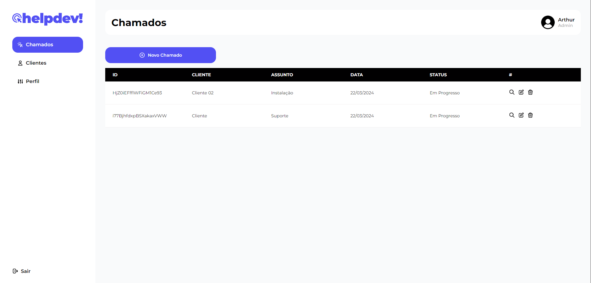
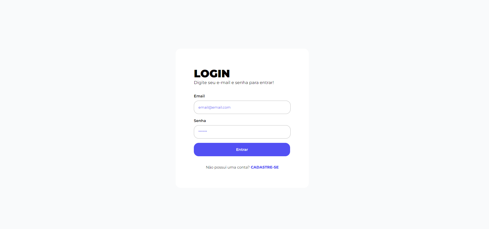
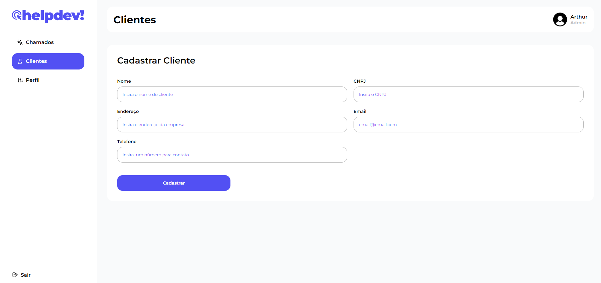

# Mais que atender, entender

### 💡Sobre o projeto

Esta aplicação foi criado para colocar em prática os conhecimentos adquiridos em Reactjs, Styled-Components e Firebase.

Com o Help Desk, é possível centralizar todas as formas de comunicação com o cliente e ainda acessar históricos de atendimento sempre que necessário. Este projeto não se limita apenas a funcionalidades básicas. Foram incorporados conceitos avançados, como o react-router-dom para uma navegação fluida entre páginas, implementação de rotas privadas para garantir segurança, adoção de HTML semântico para uma experiência de usuário aprimorada, React Context,e operações de CRUD (criar, deletar, ler, atualizar informações no banco de dados) para uma gestão de dados eficaz.

### 💻Tecnologias usadas

### 😊Autor

**Arthur** - _Codificação e criação do designer da aplicação_

### 🚀Demo

<a href="https://helpdev-one.vercel.app/">Link do Projeto</a>

<a href="https://www.figma.com/file/lfhjZKKQejVWzXTxOUBycM/helpDev?type=design&node-id=0%3A1&mode=design&t=bnOWbiYVOKSnAJlW-1">Link do Figma</a>
